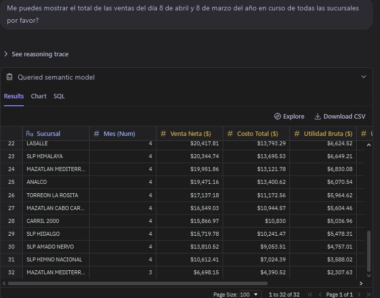
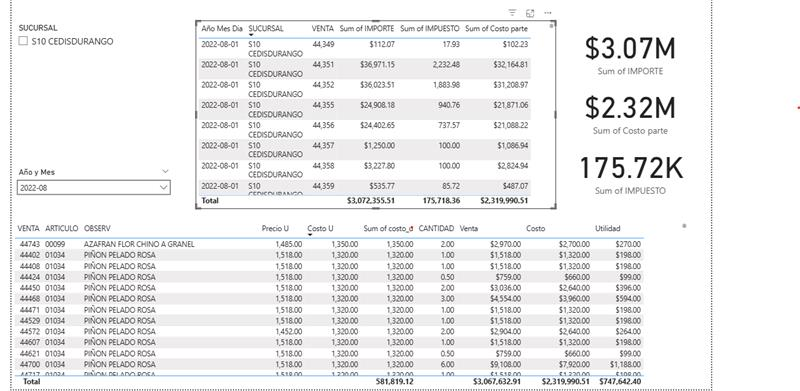
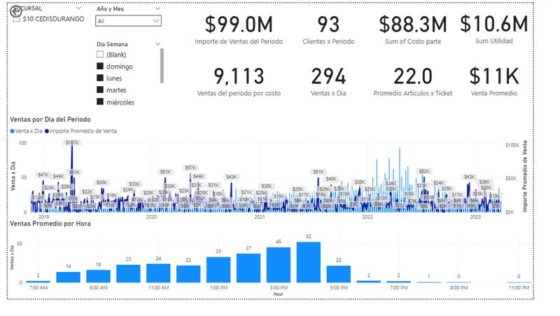
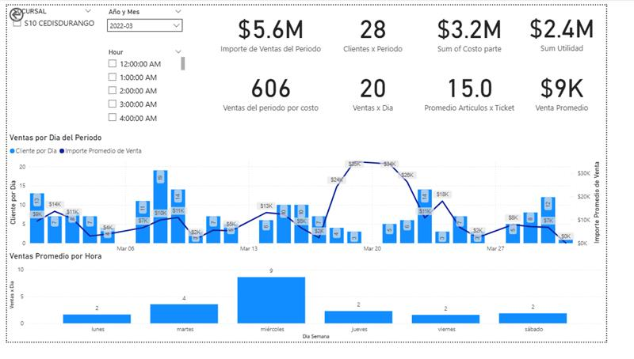
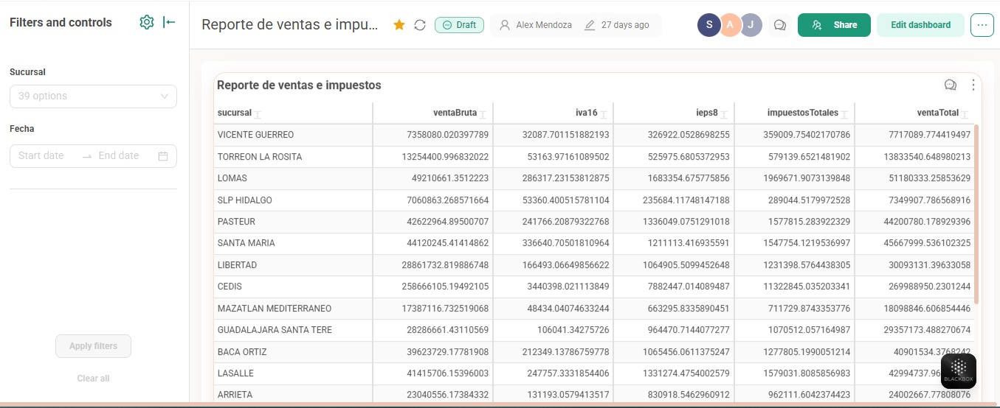

# DocsEjemplos

Ejemplo de algunos documentos ejecutivos de análisis de datos.

Este repositorio forma parte de mi portafolio profesional y contiene ejemplos visuales de dashboards, reportes ejecutivos y análisis de información comercial.  
Las imágenes muestran trabajos relacionados con visualización de datos, validación de métricas, análisis de ventas, costos, utilidad e impuestos.

## Dashboard de ventas e impuestos

Este proyecto muestra diferentes vistas de análisis desarrolladas para consultar información clave por sucursal, periodo y producto.

### Objetivo

Facilitar la revisión de indicadores comerciales mediante dashboards y reportes visuales que permitan analizar:

- Ventas por periodo
- Costos
- Utilidad bruta
- Impuestos
- Ventas por día
- Ventas por hora
- Comparativo por sucursal
- Detalle de ventas por artículo

## Capturas del proyecto

### Dashboard general de ventas

Vista general con indicadores principales como importe de ventas del periodo, clientes, costo, utilidad, ventas por día y venta promedio por hora.

---

### Detalle de ventas por artículo

Reporte con desglose de ventas, costos, impuestos y utilidad por producto.  
Esta vista permite analizar la información a nivel artículo y validar cifras de operación.

---

### Consulta desde modelo semántico

Ejemplo de consulta realizada desde un modelo semántico para obtener ventas netas, costo total y utilidad bruta por sucursal.

---

### Reporte de ventas e impuestos

Dashboard desarrollado para analizar ventas brutas, IVA, IEPS, impuestos totales y venta total por sucursal.

---

### Dashboard filtrado por mes

Vista filtrada por mes y sucursal, mostrando métricas de ventas, clientes, costo, utilidad y comportamiento diario.

## Herramientas y habilidades aplicadas

- Power BI
- Preset.io
- Cube.dev
- SQL
- Modelado de datos
- Análisis de ventas
- Validación de indicadores
- Visualización de datos
- Reportería ejecutiva

## Propósito del repositorio

Este repositorio tiene como objetivo mostrar ejemplos de mi trabajo en análisis de datos y creación de reportes visuales para portafolio profesional.

Las capturas incluidas son únicamente de carácter demostrativo.
